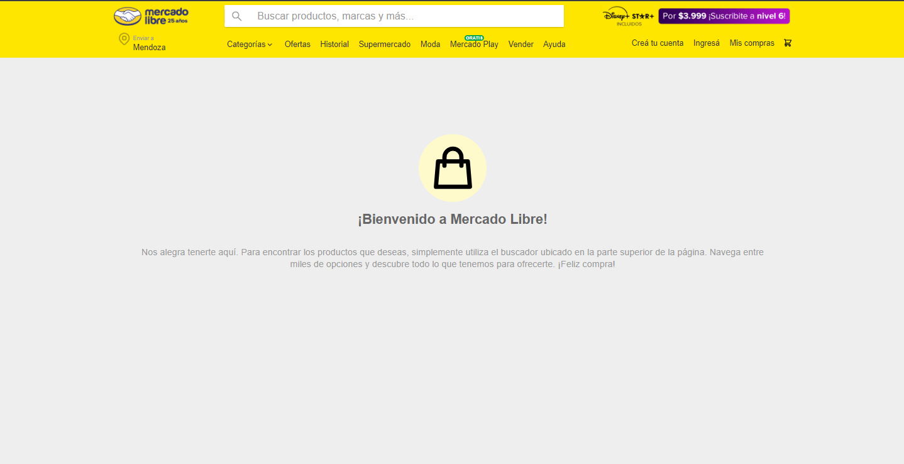
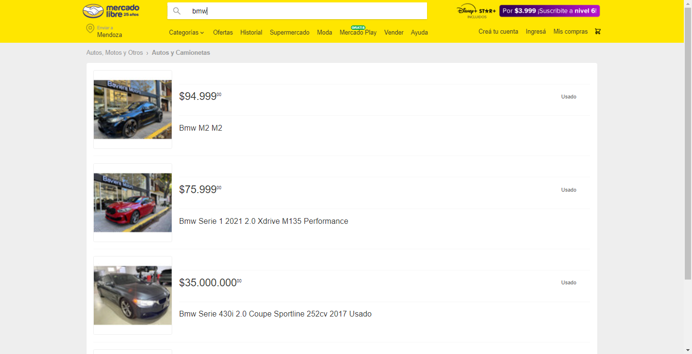
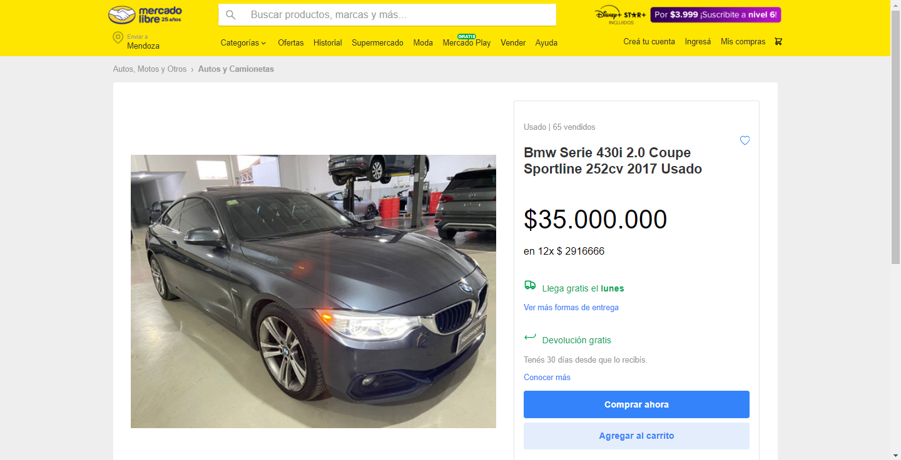
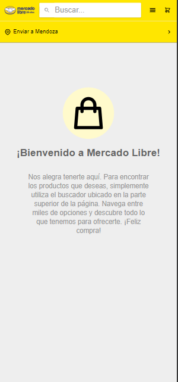
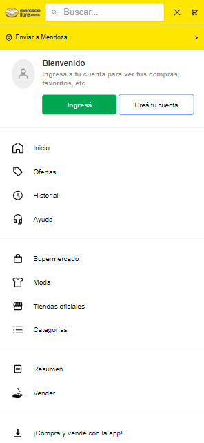
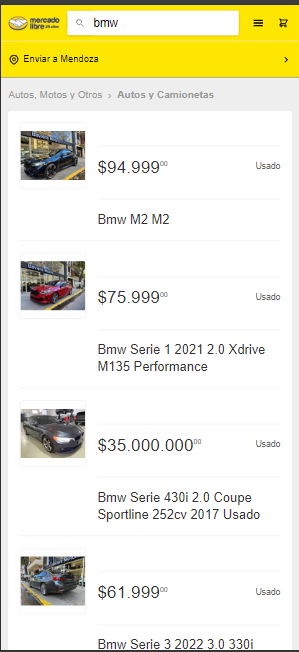
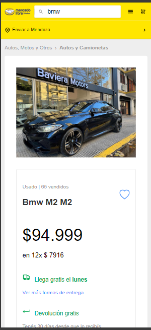

#  Desafío Frontend

Este repositorio contiene el código fuente para el Desafío Frontend de MercadoLibre.

## Enlace al Repositorio

El código fuente se encuentra disponible en [https://github.com/execriss/challenge-ML](https://github.com/execriss/challenge-ML).

## Descripción

Este proyecto consiste en la implementación de una aplicación web que incluye tres componentes principales: la caja de búsqueda, la visualización de resultados y la descripción detallada del producto. Se utilizó un stack tecnológico moderno para su desarrollo.

## Tecnologías

### Cliente

- React
- Sass
- Axios

### Servidor

- Node.js
- Express
- Axios

## Instalación

Para instalar las dependencias, ejecuta el siguiente comando:
npm install

## Uso Server

Para utilizar la aplicación server, sigue las siguientes instrucciones:

1. Clona el repositorio.
2. Instala las dependencias utilizando `npm install`.
3. Ejecuta el servidor con `npm run dev`.
4. El servidor estará disponible en [http://localhost:3000](http://localhost:3000).

## Estilos

Se utilizó Sass para los estilos, con una estructura modularizada. Los estilos principales se encuentran en `main.scss`.

## Uso Cliente

Para utilizar la aplicación cliente, sigue las siguientes instrucciones:

1. Clona el repositorio.
2. Instala las dependencias utilizando `npm install`.
3. Ejecuta el cliente con `npm run dev`.
4. Accede a [http://localhost:5173/](http://localhost:5173/) en el navegador.

## Endpoints del Servidor

El servidor proporciona los siguientes endpoints:

- `/api/items?q=:query`: Consulta los resultados de búsqueda en base a la consulta proporcionada.
- `/api/items/:id`: Obtiene la información detallada de un producto en particular.

## Descripción Funcional

La aplicación consta de tres vistas principales:

1. **Caja de Búsqueda**: Permite al usuario ingresar el producto que desea buscar. Al enviar el formulario, se navega a la vista de Resultados de Búsqueda, donde se muestran los primeros 4 productos relacionados.
2. **Resultados de Búsqueda**: Muestra los resultados de la búsqueda realizada. Cada producto es navegable y al hacer clic en uno de ellos, se navega a la vista de Detalle del Producto.
3. **Detalle del Producto**: Muestra la información detallada de un producto específico.

Además, la aplicación es totalmente navegable, ya que cada vista tiene su propia URL.

## Capturas de Pantalla

A continuación, se muestran algunas capturas de pantalla de la aplicación:

*Figura 1: Caja de Búsqueda*

*Figura 2: Resultados de Búsqueda*

*Figura 3: Detalle del Producto*

## Responsive

*Figura 1: Caja de Búsqueda*

*Figura 2: Menú Hamburguesa*

*Figura 3: Resultados de Búsqueda*

*Figura 4: Detalle del Producto*